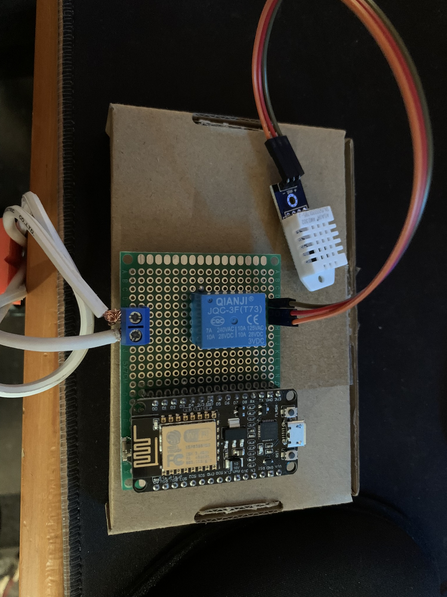
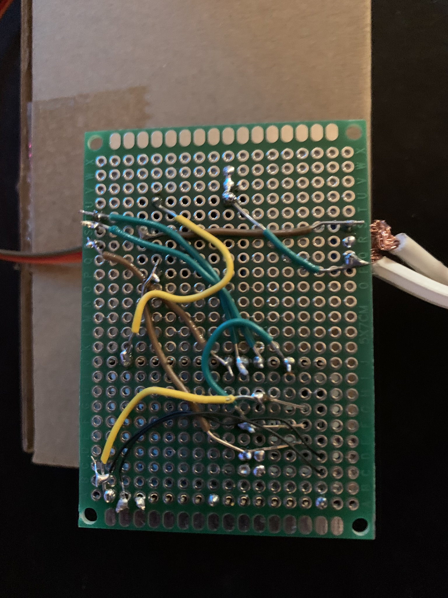

# ESP8266-12E-DHT-Thermostat
IoT thermostat using an ESP8266-12E and a DHT 22.  Access web server with a browser to change thermostat settings and view data on google charts.

This project is exapnded on user dmainmon. See the original project at https://www.instructables.com/ESP8266-12E-DHT-Thermostat/

The aim of this project is to produce a modified layout to the web server, heat cycling, and expanded instructions.

#### Major Changes:
+ Enhanced web design (CSS layout)
+ HTTP username and password authentication
+ Converted to AsyncWebServer library
+ NTP Client
+ Schematic Diagram

#### Schematic Diagram

#### PCB

#### Materials
| Name                                                                                      | Additional Notes                        |
| ----------------------------------------------------------------------------------------- | --------------------------------------- |
| [Transistor 2N3904](https://www.amazon.com/gp/product/B09YTSR9Z9/ref=ppx_yo_dt_b_asin_title_o03_s02?ie=UTF8&psc=1) | Link provided is a kit                                     |
| [DC 3V Coil Power Relay JQC-3F](https://www.amazon.com/gp/product/B00IIDY8JU/ref=ppx_yo_dt_b_asin_title_o03_s02?ie=UTF8&psc=1) | 10A Max                                 |
| [ESP8266](https://www.amazon.com/gp/product/B09SPWYS4B/ref=ppx_yo_dt_b_asin_title_o03_s01?ie=UTF8&psc=1)             | 3pc kit that comes with micro-USB cables                                    |
| [PCB, Terminal Block, and Headers](https://www.amazon.com/gp/product/B07NM68FXK/ref=ppx_yo_dt_b_asin_title_o03_s00?ie=UTF8&psc=1) | Kit. A different terminal block was used due to the one in the kit being too small for the "hot" wire of the extension cord                                     |
| [Micro-USB Female Socket](https://www.amazon.com/gp/product/B07QY698J5/ref=ppx_yo_dt_b_asin_title_o02_s00?ie=UTF8&psc=1)  | Only need access to the first and last pins |
| [DHT22 AM2302](https://www.amazon.com/gp/product/B0795F19W6/ref=ppx_yo_dt_b_asin_title_o01_s00?ie=UTF8&psc=1)         | Withstands below freezing temperatures |

Not pictured: Ferrule Crimpers, extension cord, ceramic heat-bulbs, hot glue

#### Instructions
##### Hardware
1. Follow the wiring diagram given in the docs
2. Split an extension cable's hot wire and attach the two ends to the terminal block. To prevent damaging the copper, use Ferrule Crimpers. 110V/AC
3. Connect the heat lamp to the extension cord. Note: The max rating for the relay is 10A. A beefier relay would be needed to work on a full-blown space heater.
4. If everything works right, I recommend hot-gluing the back of the PCB to keep any wires from breaking off. If for outside use, store the board in something like a gang box.
##### Software
1. Download Arduino

