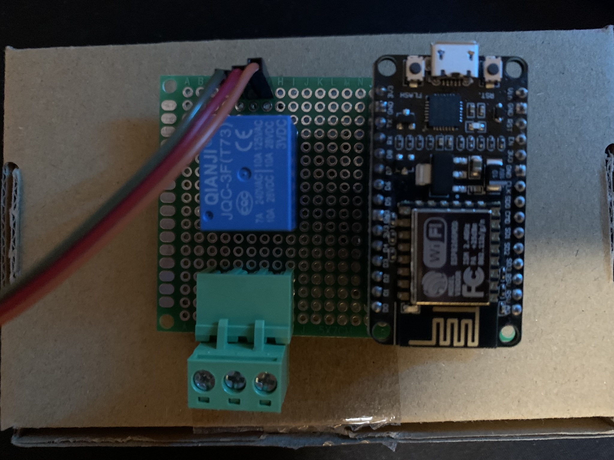

# ESP8266 Temperature Controlled Relay
IoT thermostat using an ESP8266-12E, DHT 22, and relay. Provides access to a web server to change thermostat settings and view data on google charts.

This project is exapnded on user dmainmon. See the original project at https://www.instructables.com/ESP8266-12E-DHT-Thermostat/

The aim of this project is to produce a modified layout to the web server, easier modification, heat cycling, and additional instructions.

### Major Changes:
+ Enhanced web design (CSS layout)
+ Converted to AsyncWebServer library
+ Switched to literal for the web server code
+ HTTP username and password authentication
+ NTP Client
+ Schematic Diagram

### Web Layout

### Schematic Diagram

### Breadboard and PCB

### Materials
| Name                                                                                      | Additional Notes                        |
| ----------------------------------------------------------------------------------------- | --------------------------------------- |
| [Transistor 2N3904](https://www.amazon.com/gp/product/B09YTSR9Z9/ref=ppx_yo_dt_b_asin_title_o03_s02?ie=UTF8&psc=1) | Link provided is a kit                                     |
| [DC 3V Coil Power Relay JQC-3F](https://www.amazon.com/gp/product/B00IIDY8JU/ref=ppx_yo_dt_b_asin_title_o03_s02?ie=UTF8&psc=1) | 10A Max                                 |
| [ESP8266](https://www.amazon.com/gp/product/B09SPWYS4B/ref=ppx_yo_dt_b_asin_title_o03_s01?ie=UTF8&psc=1)             | 3pc kit that comes with micro-USB cables                                    |
| [PCB, Terminal Block, and Headers](https://www.amazon.com/gp/product/B07NM68FXK/ref=ppx_yo_dt_b_asin_title_o03_s00?ie=UTF8&psc=1) | Kit. A different terminal block was used due to the one in the kit being too small for the "hot" wire of the extension cord                                     |
| [Micro-USB Female Socket](https://www.amazon.com/gp/product/B07QY698J5/ref=ppx_yo_dt_b_asin_title_o02_s00?ie=UTF8&psc=1)  | Only need access to the first and last pins |
| [DHT22 AM2302](https://www.amazon.com/gp/product/B0795F19W6/ref=ppx_yo_dt_b_asin_title_o01_s00?ie=UTF8&psc=1)         | Withstands below freezing temperatures |

**Not pictured:** Ferrule Crimpers, extension cord, ceramic heat-bulbs, hot glue

### Instructions
#### Hardware
1. Follow the wiring diagram given in the docs
	2. It is recommended to first try the breadboard configuration (and before using hot glue on the PCB) with the provided Arduino sketch to ensure everything works.
2. Split an extension cable's hot wire and attach the two split ends to the terminal block. To prevent damaging the copper, use Ferrule Crimpers. 110V/AC
3. Connect the heat lamp to the extension cord. Note: The max rating for the relay is 10A. A beefier relay would be needed to work on a full-blown space heater and/or larger appliance.
4. If everything works right, I recommend hot-gluing the back of the PCB to keep any wires from breaking off. If for outdoor use, store the board in something like a gang box with the DHT sensor snaking out of it.
#### Software
1. Download Arduino and the sketch found in _**/main/ESP8266_Temperature_Controlled_Relay**_
2. Select the NodeMCU ESP-12E board from the board manager 
3. Install required libraries
	1. DHT11/DHT22 (can be found in Arduino IDE Library)
	2. NTPClient (can be found in Arduino IDE Library)
	3. [ESPAsyncWebServer](https://github.com/me-no-dev/ESPAsyncWebServer) (GitHub)
	4. [ESPAsyncTCP](https://github.com/me-no-dev/ESPAsyncTCP) (GitHub)
4. Change network information (SSID & password), time offset for NTP Client (based off your current timezone), IP Address, and (optional) http credentials (username and password).

**Note**: If having difficult with one or more of the libraries in the final sketch, the next section provides some additional resources and detailed instruction that can help with testing a package.

### Additional Resources
This table will provide a topic, link, and its use in this project for exploring specific packages.
| Title | Purpose |
| --- | --- |
| [DHT11 on ThingSpeak](https://how2electronics.com/dht11-humidity-temperature-nodemcu-thingspeak/) | Temperature and Humidity sensor web API. Must declare DHT22 instead of DHT11 (if using a DHT22) |
| [ESP8266 NodeMCU Async Web Server](https://randomnerdtutorials.com/esp8266-nodemcu-async-web-server-espasyncwebserver-library/) | Provides basic HTTP authentication for the web server |
| [ESP8266 NTP Client](https://randomnerdtutorials.com/esp8266-nodemcu-date-time-ntp-client-server-arduino/) | Provides ability to have a responsive time displayed on the web server. |

